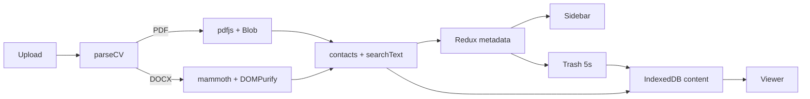

# CV Viewer

A local-first résumé workspace for the browser.
No backend. No accounts. No cloud.


## Quick start

```bash
npm i && npm run dev
```

Click **"Завантажити демо-дані"** (Load demo data) to seed two built-in CVs (a Frontend PDF and a Backend DOCX).
The UI is in Ukrainian. Files never leave the browser.

## What it is

CV Viewer lets you upload a candidate's PDF or DOCX résumé and get an instant candidate card — contacts, skills, full-text search with in-document highlighting — plus a simple hiring pipeline to track them through the process.

## Features

- PDF / DOCX upload and drag-and-drop (15 MB cap)
- Built-in demo data for a no-file quick look
- IndexedDB storage: metadata in Redux, file content as `Blob` / HTML
- Candidate card with email, phone, and heuristically parsed skills
- Full-text search with in-document highlighting
- Hiring pipeline: New → Interview → Offer / Rejected, with tags
- Soft delete with a 5-second Undo that survives a page refresh
- Resizable sidebar, mobile drawer, keyboard-friendly controls
- Strict TypeScript, Vitest test suite, GitHub Actions CI

## 2-minute walkthrough

1. Click **"Завантажити демо-дані"**
2. Open the Frontend PDF, change its status, add a tag
3. Search for `accessibility` or `NestJS` — the list filters and matches are highlighted in the document
4. Delete a card, then click **"Скасувати"** (Undo), or refresh within the 5-second window
5. Drop in your own `.pdf` or `.docx`

Demo fixtures: [`src/utils/samples.ts`](./src/utils/samples.ts)

## Architecture



| Layer    | Store                 | Data                                        |
| -------- | --------------------- | -------------------------------------------- |
| UI       | Redux Toolkit         | list, active id, search query, undo toast    |
| Metadata | IndexedDB `metadata`  | name, status, tags, contacts, `searchText`   |
| Content  | IndexedDB `content`   | PDF `Blob` or sanitized HTML                 |
| Trash    | IndexedDB `trash`     | pending deletions until purge                |

Reducers are pure functions. All I/O lives in thunks and [`src/utils/db.ts`](./src/utils/db.ts).

## Scripts

```bash
npm run dev     # start the dev server
npm run test    # run the test suite
npm run lint    # run the linter
npm run build   # production build
```

Requires **Node 22+**. CI pipeline: [`.github/workflows/ci.yml`](./.github/workflows/ci.yml) (`lint` → `test` → `build`).

Tests cover full-text search filtering, XSS-safe highlighting, trash reconciliation, undo, upload limits, sidebar error states, and demo seeding.

## Tech stack

`React 19` · `TypeScript` · `Redux Toolkit` · `Vite 8` · `Tailwind CSS 4`
`localforage` · `react-pdf` · `mammoth` · `DOMPurify` · `Vitest`